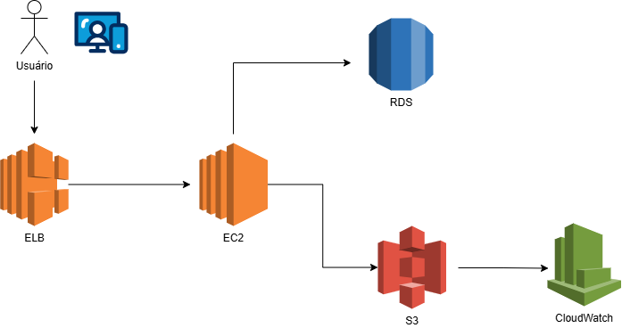

# Desenho-de-arquitetura-de-software-AWS-alto-processamento
Nesse diagrama nso vemos o usuario enviar dados via navegador, o ELB distribiu as requisiçoes, o EC2 processam os dados escalam conforme a demanda, o AmazonS3 amazena arquivos do usuario e isso fica escalavel e barato,  o RDS guarda os dados estruturados, o CloudWatch monitora logs e desempenho, e o VPC faz o isolamento de rede. 

